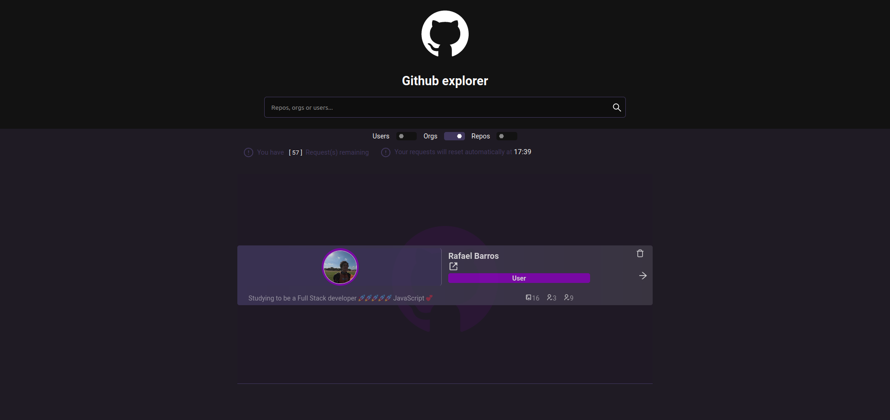

<div align="center">
    
     
</div>
  <h1 align="center">Github explorer</h1>
<br>
Github explorer is project that uses the github API to display info about users, repositories and organizations.
<br>
<br>

### Built With

- [React.js](https://reactjs.org/)
- [Sass](https://sass-lang.com/)
- [React-icons](https://react-icons.github.io/react-icons//)
- [Typescript](https://www.typescriptlang.org/)

# :rocket: Features

- [x] User can search for repositories users or organizations.
- [x] Repository listing.
- [x] User can see delete an repository from list.
- [x] User can see repositories details.
- [x] User cannot fetch if search input is empty.
- [x] User can see repositories details.

## ToDo

- [ ] Send token in the requisition for unlimited requisitions.
- [ ] Repository details page.
- [ ] Save repository data in local storage.
- [ ] Improve project structure.

## Getting Started

1. Clone the repo
   ```sh
   git clone https://github.com/Rafaelb4rros/githubexplorer.git
   ```
2. Install packages
   ```sh
   yarn install
   ```
3. Start the project
   ```js
   yarn dev
   ```
   <!-- LICENSE -->

## License

Distributed under the MIT License.

<p align="right">(<a href="#top">back to top</a>)</p>

Project Link: [https://github.com/Rafaelb4rros/githubexplorer](https://github.com/Rafaelb4rros/githubexplorer)
